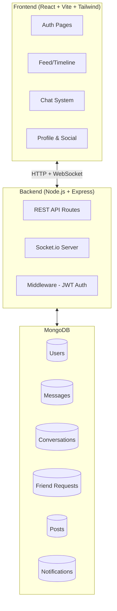

# Tribe - Social Media Chat App Implementation Plan

## Architecture Overview



## Project Structure

```
Tribe/
├── client/          # React + Vite frontend
│   ├── src/
│   │   ├── components/
│   │   ├── pages/
│   │   ├── context/
│   │   ├── hooks/
│   │   ├── utils/
│   │   └── assets/
│   └── ...
├── server/          # Node.js + Express backend
│   ├── config/
│   ├── controllers/
│   ├── middleware/
│   ├── models/
│   ├── routes/
│   ├── socket/
│   └── server.js
└── package.json
```

## Phase 1: Backend Foundation
- [x] Express server setup
- [x] MongoDB connection
- [x] User model + Auth routes (JWT + bcrypt)
- [x] Middleware (auth, error handling)

## Phase 2: Social Features
- [x] Friend request model + routes
- [x] Follow/unfollow
- [x] User search
- [x] Profile management

## Phase 3: Chat System
- [x] Conversation & Message models
- [x] Socket.io integration
- [x] 1-on-1 messaging
- [x] Group chats
- [x] Typing indicators
- [x] Read/delivered status

## Phase 4: Feed System
- [x] Post model
- [x] Create/like/comment
- [x] Real-time updates

## Phase 5: Frontend
- [x] Auth pages (Login/Signup)
- [x] Chat interface
- [x] Feed/Timeline
- [x] Profile pages
- [x] Social features UI
